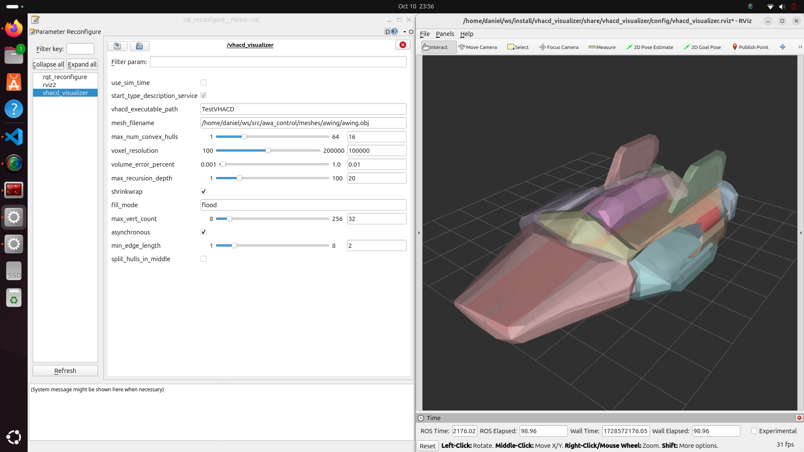

# VHACD Visulizer

A ROS2 package for interactively visualizing the result of convex decomposition of your OBJ files.



## What does this package do?

This package is essentially a poor mans version of a interactive convex decomposition visualization app, using
1. RViz for visualization
2. rqt_reconfigure for interactive / online parameter tuning, and
3. The example executable provided in https://github.com/kmammou/v-hacd/app

At it's core it's just a small (~200 LOC) Python node that
* exposes V-HACD parameters as parameters that can be dynamically reconfigured via rqt
* exposes a parameter for the user to specify the input mesh (also reconfigurable)
* listens to parameter updates, runs the V-HACD executable via `subprocess` and publishes both input mesh and output convex hulls on a `visualization_msgs/MarkerArray` topic that can be viewed in RViz.

## Requirements

Requires a Ubuntu system and that the V-HACD app has been built somewhere (see Installation).

## Installation

1. Clone and build this repo into your colcon workspace
```
cd ~/colcon_ws/src
git clone https://github.com/danielcranston/vhacd_visualizer
cd ..
colcon build --packages-select vhacd_visualizer
```
2. Clone and build the V-HACD app
```
cd ~/colcon_ws/src/vhacd_visualizer
git clone -b v4.1.0 git@github.com:kmammou/v-hacd.git third_party/v-hacd
cmake -S third_party/v-hacd/app -B third_party/v-hacd/app/build -DCMAKE_BUILD_TYPE=Release
cmake --build third_party/v-hacd/app/build
```
3. (optional) Make a symlink so the VHACD app is made trivially discoverable, e.g.
```
sudo ln -s `pwd`/third_party/v-hacd/app/build/TestVHACD /usr/local/bin
```

## Running the visualizer launch file

First make sure to source your workspace

### Launch arguments

```
ros2 launch vhacd_visualizer vhacd_visualizer.launch.py --show-arguments
Arguments (pass arguments as '<name>:=<value>'):

    'run_rviz':
        Whether to run RViz
        (default: 'true')

    'mesh_filename':
        Full path to the input mesh

    'vhacd_executable_path':
        Path to the 'TestVHACD' executable
        (default: 'TestVHACD')
```

### Example launch

```
ros2 launch vhacd_visualizer vhacd_visualizer.launch.py mesh_filename:=/path/to/mesh.obj
```

If you did not run step 3 in Installation, you'll have to specify the path to the V-HACD executable via the `vhacd_executable_path` launch argument or rqt_reconfigure.